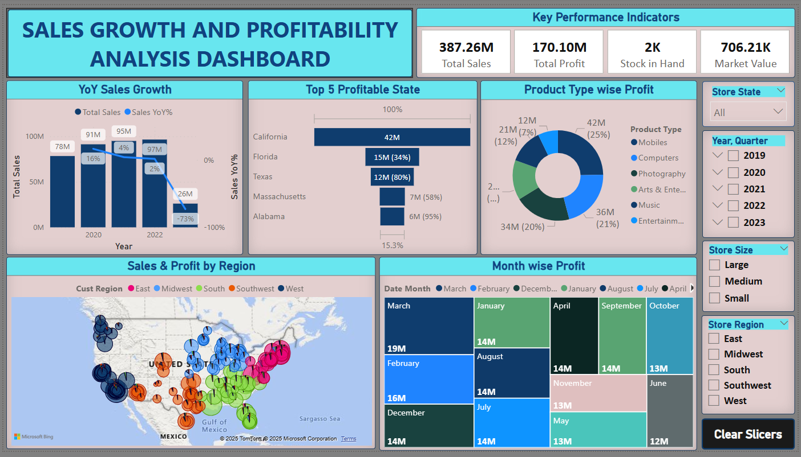

# Supply-Chain-Management-Analysis Dashboard (Power BI) 📊

## 📌 Project Overview

This project provides a comprehensive analysis of sales and profit performance across multiple dimensions—region, customer segment, store size, and product categories. Built using Power BI, the dashboard offers clear insights to support data-driven decisions and optimize supply chain efficiency.

---

## 🎯 Problem Statement

The company is facing inconsistent sales and profit performance across different years, regions, product types, and customer segments. Sales in 2023 dropped significantly, and there is no clear visibility on which areas, customer groups, or product lines are driving or dragging performance. These gaps make it difficult to take strategic actions.

---

## 🧰 Tool Used

- **Power BI** – For data visualization, interactive exploration, and business insights

---

## 📊 Key Insights

- 📉 Sales peaked in **2021–2022** but dropped sharply in **2023**
- 🏬 **Small-sized stores** are more profitable than medium-sized ones
- 📍 **California** is the top-performing state in both sales and profit
- 🛍️ **Creative & Arts** products sell most, but **mobile devices** generate higher profits
- 👨‍💼 **Male customers aged 36–55** are the most valuable customer segment
- 🏢 **Stores from 2009, 2010, 2012, and 2017** perform best; those from **2008, 2014, and 2018** underperform

---

## 📊 Dashboard Preview

### 🔹  Supply-Chain-Management-Analysis Dashboard 


---

## ✅ Recommendations

- Expand successful stores and replicate strategies from 2009–2017
- Focus on mobile products for profit growth, while supporting Creative & Arts for volume
- Target male customers aged 36–55 through personalized marketing
- Reassess and optimize underperforming stores
- Monitor yearly trends to quickly detect and respond to sales downturns

---

## 📁 Project Structure

```bash
Supply-Chain-Dashboard-Analysis/
│
├── Data/
│   └── cleaned_dataset.xlsx
│
├── Dashboards/
│   └── power_bi_dashboard.pbix
│
├── Images/
│   └── dashboard_preview.png
│
├── README.md
